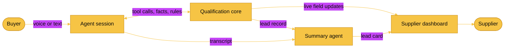
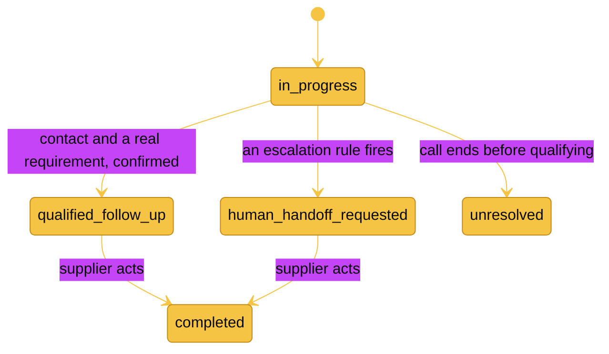

<div align="center">

# Supplier Voice Agent

**An inbound AI voice agent that answers buyer calls for secondhand clothing suppliers, qualifies the deal inside supplier rules, and hands over a ready-to-action lead.**

[](https://fleek.co)
[](#)
[](https://nextjs.org)
[](https://www.typescriptlang.org)
[](https://vitest.dev)

</div>

It is 3am in Karachi. A buyer in London wants 200 pieces of 90s denim. Normally that call rings out and the sale walks. This agent picks up, answers only from the supplier's own catalogue, qualifies the request, and leaves a structured lead in the dashboard by morning.

The agent qualifies. The supplier closes.

## Screenshots


| Live call | Lead the supplier wakes up to |
| --- | --- |
|  |  |

## What it does

- Answers buyer calls 24/7 in the browser, live voice or text, on the same pipeline.
- Answers only from supplier-approved knowledge. It never invents a price or a promise.
- Fills the qualification fields live as the buyer talks, then confirms them back.
- Escalates to a human when a rule says so, for example a discount ask or a complaint.
- Writes a lead card with a grounded summary, transcript, and a recommended next action.

## How it works

One rule runs everything: the model talks, deterministic code decides. The LLM never sets a lead status, never invents a number, and never chooses to escalate. When the call ends, the summary agent narrates the record the core already built. It rewords, it does not decide.



For live voice, the qualification core runs in a session server (`apps/server`) and streams field updates to the browser over a WebSocket, so the chips fill in real time during the call.

The deciding is done by four parts:

| Part | What it does | Status |
| --- | --- | --- |
| Qualification state machine | Tracks filled fields, picks the next question, moves the lead between states | Built and tested |
| Escalation rules engine | Supplier-editable rules, checked on every turn | Built and tested |
| Knowledge lookup | Returns catalogue facts, or `not_found` so the agent says it does not know | Built and tested |
| Numeric provenance guardrail | Rejects any number in the summary that did not come from a knowledge lookup, then falls back to a deterministic template | Built and tested |

## Post-call summary

The summary agent turns the finalised lead into a short brief plus a few grounded key points, each with its own label. The status and next action come from the deterministic core, so the card renders even with no LLM key. On any provider problem, no key, timeout, bad JSON, or an invented number, it degrades to a deterministic template and the card still renders.

The eval harness (`@fleek/evals`) drives the pipeline through a set of buyer personas and asserts the agent stayed inside the rules: no ungrounded numbers, correct escalations, correct terminal status. It can run against a standalone scripted pipeline or the live server, and ships deliberately broken streams to prove the assertions catch a lying agent.

## Lead lifecycle



## Run it

The project is a pnpm workspace. Live voice runs against an ElevenLabs agent, with the session server feeding the qualification chips. Text mode replays a scripted call, so it works with no backend.

```bash
pnpm install
pnpm -r test              # qualification core, summary, eval, and server tests
pnpm evals                # run the persona eval suite

# terminal 1: session server for live voice field updates
pnpm dev:server           # http://localhost:3001

# terminal 2: Next.js UI
cd web && pnpm dev        # http://localhost:3000
```

Or run both together from the root: `pnpm dev`

Environment:

- `OPENAI_API_KEY` is optional. Without it the summary agent uses its deterministic template. Set `SUMMARY_MODEL` to override the default model.
- The ElevenLabs agent id ships with a default, so live voice works out of the box. Override with `NEXT_PUBLIC_ELEVENLABS_AGENT_ID`.

Demo shortcuts:

- Live voice, autostart: `http://localhost:3000/?autoplay=1`
- Scripted text demo: `http://localhost:3000/?autoplay=1&mode=text`
- Text mode by hand: click "Type instead" on the home screen.

## Project layout

```
packages/shared        Shared TypeScript contracts (events, lead, tools)
packages/core          Deterministic qualification core, tests, seed catalogue
packages/summary       Post-call summary agent, grounded against the lead record
packages/evals         Persona eval harness and rule assertions
packages/voice-client  Browser transport to the session server (HTTP + WS)
apps/server            Session API and WebSocket event bus for live voice
web                    Next.js single-screen UI (idle, call, composing, summary)
plans                  Build plans
```

## Stack

- Next.js, React, TypeScript, Tailwind
- ElevenLabs for the live voice call, agent and UI
- OpenAI for the post-call summary agent, behind a template fallback
- Vitest for the core, summary, eval, and server suites

<div align="center">

Built at the Fleek x a16z hackathon.

</div>
