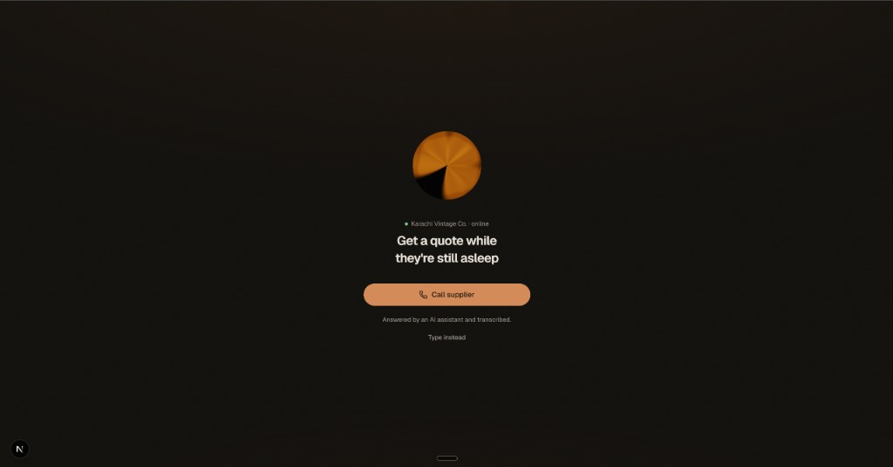
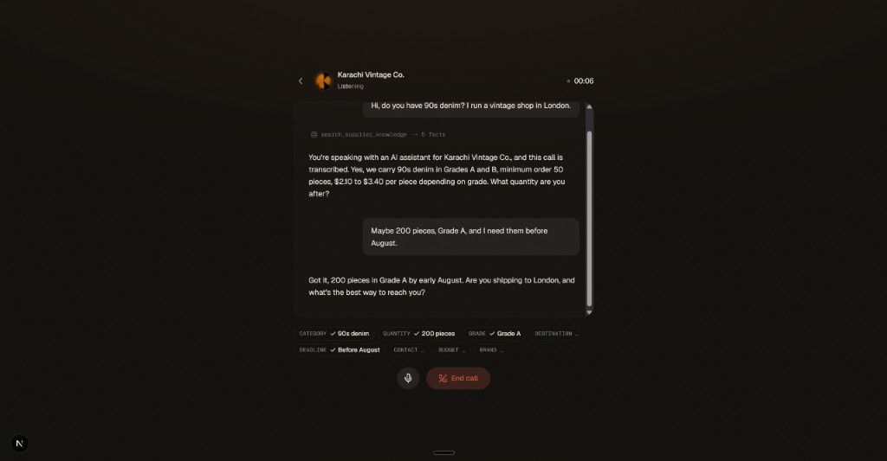
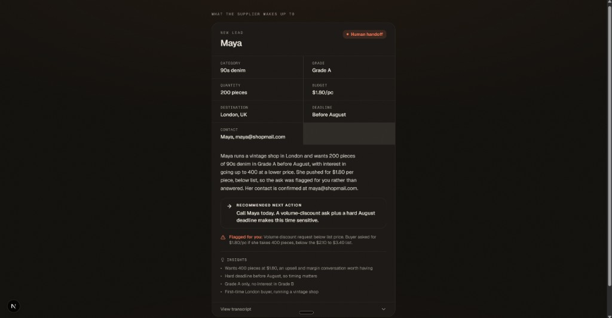
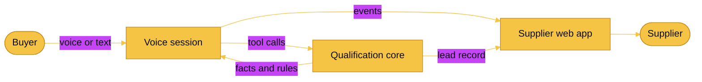
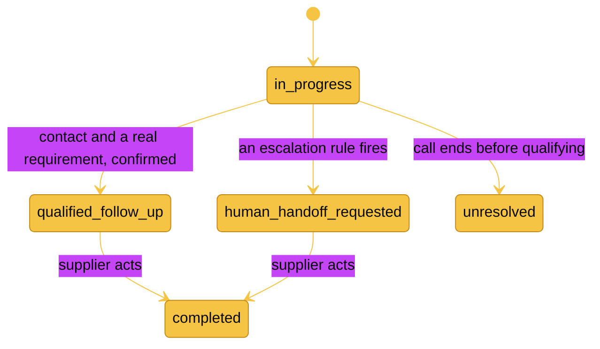

<div align="center">

# Supplier Voice Agent

**An inbound AI voice agent that answers buyer calls for secondhand clothing suppliers, qualifies the deal inside supplier rules, and hands over a ready-to-action lead.**

[](https://fleek.co)
[](#)
[](https://nextjs.org)
[](https://www.typescriptlang.org)
[](https://vitest.dev)

</div>

It is 3am in Karachi. A buyer in London wants 200 pieces of 90s denim. Normally that call rings out and the sale walks. This agent picks up, answers only from the supplier's own catalogue, qualifies the request, and leaves a structured lead in the dashboard by morning.

The agent qualifies. The supplier closes.

## Screenshots



| Live call | Lead the supplier wakes up to |
| --- | --- |
|  |  |

## What it does

- Answers buyer calls 24/7 in the browser, voice or text, on the same pipeline.
- Answers only from supplier-approved knowledge. It never invents a price or a promise.
- Asks for the qualification fields it still needs, then confirms them back.
- Escalates to a human when a rule says so, for example a discount ask or a complaint.
- Produces a lead card with fields, transcript, summary, and a recommended next action.

## How it works

One rule runs everything: the model talks, deterministic code decides. The LLM never sets a lead status, never invents a number, and never chooses to escalate.



The deciding is done by four parts:

| Part | What it does | Status |
| --- | --- | --- |
| Qualification state machine | Tracks filled fields, picks the next question, moves the lead between states | Built and tested |
| Escalation rules engine | Supplier-editable rules, checked on every turn | Built and tested |
| Knowledge lookup | Returns catalogue facts, or `not_found` so the agent says it does not know | Built and tested |
| Numeric provenance guardrail | Blocks any number that did not come from a knowledge lookup in the same call | Planned for the voice layer |

## Lead lifecycle



## Run it

The UI runs against a mock transport that replays a scripted call, so it works with no backend. The real voice client drops in behind the same interface later.

```bash
# core packages (pnpm workspace)
pnpm install
pnpm -r test          # run the qualification core tests

# web app
cd web
npm install
npm run dev           # open http://localhost:3000
```

Demo shortcuts:

- Voice playback: `http://localhost:3000/?fixture=demo&autoplay=1`
- Text mode: click "Type instead" on the home screen.

## Project layout

```
packages/shared   Shared TypeScript contracts (events, lead, tools)
packages/core     Deterministic qualification core, tests, seed catalogue
web               Next.js single-screen UI (idle, call, summary)
plans             Build plans
```

## Stack

- Next.js, React, TypeScript, Tailwind
- ElevenLabs UI for the call screen (the orb and conversation view)
- OpenAI Realtime or ElevenLabs for voice, behind a provider-agnostic transport
- Vitest for the qualification core

<div align="center">

Built at the Fleek x a16z hackathon.

</div>
